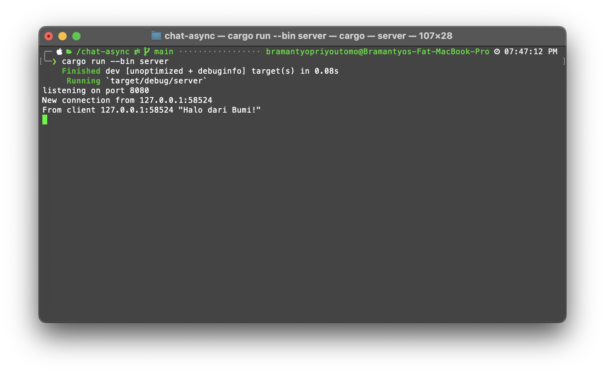
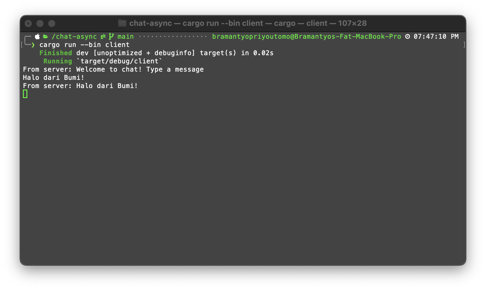
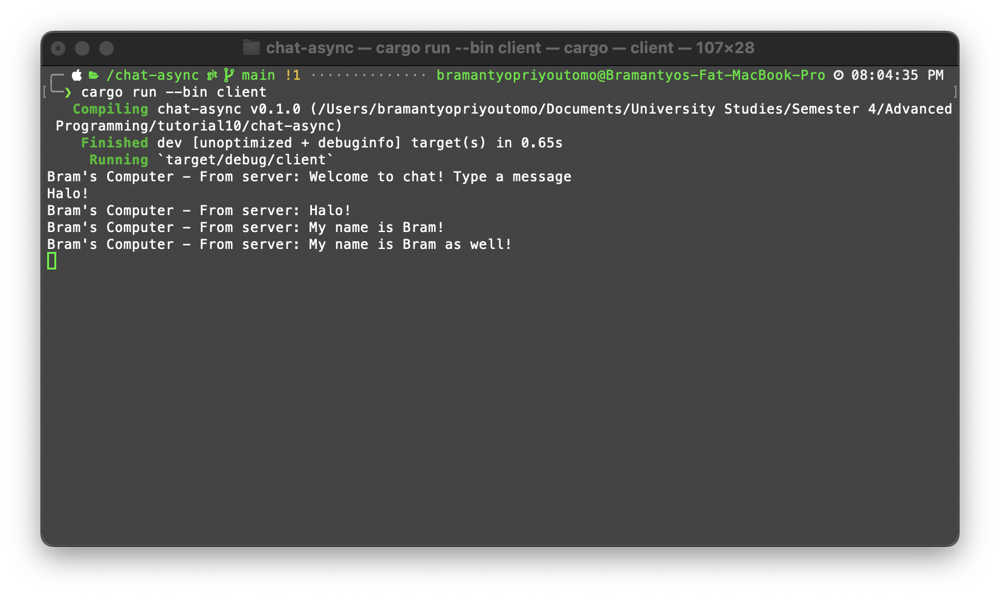
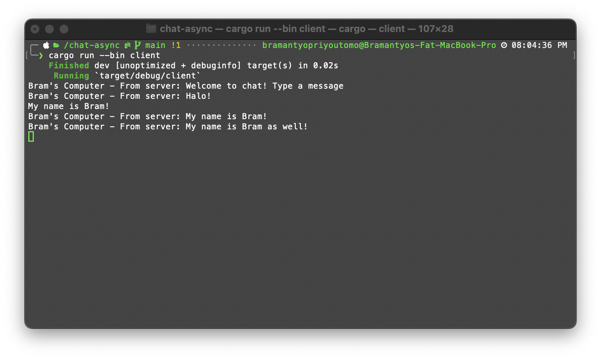
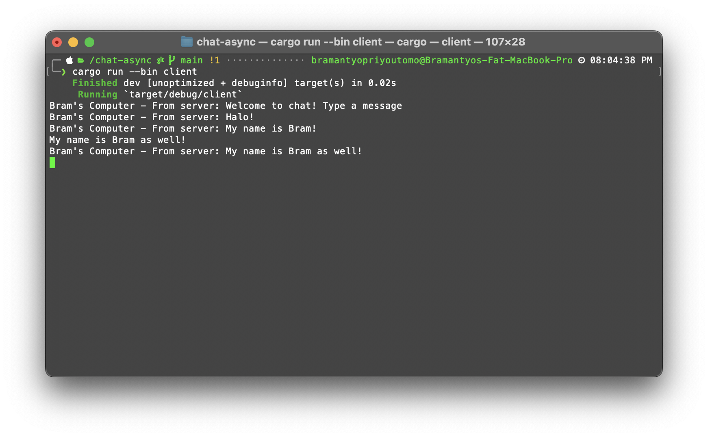
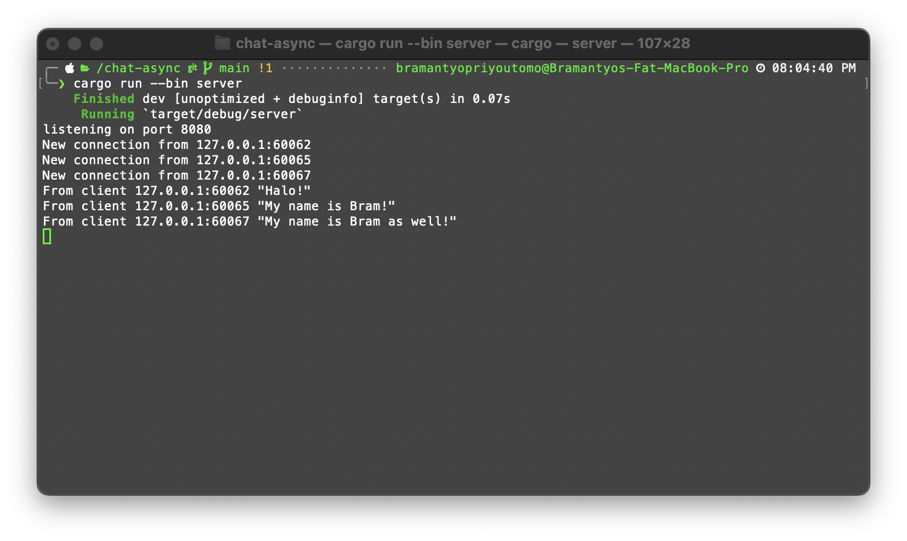

# Tutorial 10 - Async Programming

### 2.1 Original code of broadcast chat.

The client sends a message to the server, and the server receives it and echoes it back to the client.
This exchange demonstrates bidirectional communication between the server and client over the established connection.
Both the server and client seem to be properly configured to send and receive messages.

### 2.2 Modifying the websocket port

This modification establishes a chat system using WebSockets. The server, running on port 8080, listens for messages from clients. When a client connects, it can send messages to the server, which then broadcasts them to all connected clients, enabling real-time chat. The tokio_websockets crate simplifies the communication process.

### 2.3 Small changes. Add some information to client

The server successfully accepts connections from multiple clients.
Messages sent by clients are received and displayed by the server.
The client successfully receives messages broadcasted by the server, allowing for real-time communication between clients and the server.
